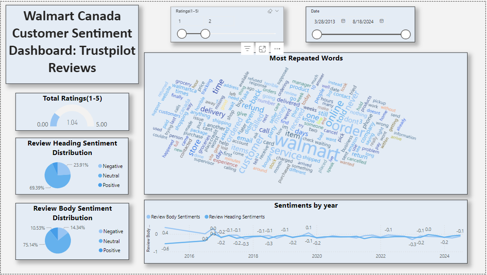

# **Walmart Canada Sentiment Analysis: Trustpilot Reviews**

## **Project Overview**
This project focuses on analyzing customer reviews for Walmart Canada sourced from Trustpilot. The primary goal is to uncover customer sentiments, preferences, and pain points to help Walmart enhance its in-store and online customer experiences. The project includes data preprocessing, sentiment analysis using the VADER library, and visualization of insights through an interactive Power BI dashboard.

---

## **Table of Contents**
1. [Dataset Description](#dataset-description)
2. [Project Workflow](#project-workflow)
3. [Key Insights](#key-insights)
4. [Technologies Used](#technologies-used)
5. [Dashboard Highlights](#dashboard-highlights)

---

## **Dataset Description**
- **Source:** Trustpilot Reviews
- **Columns:**
  - **Review Heading:** Title or heading of the review.
  - **Review Body:** Main content of the review.
  - **Date:** Date the review was written.
- **Additional Columns Created:**
  - Sentiment Scores for both Review Heading and Review Body:
    - Positive, Negative, Neutral, and Compound Scores.
  - Frequent Words: Processed list of the most common words used in the reviews (excluding stopwords).

---

## **Project Workflow**
1. **Data Collection:**  
   Extracted customer reviews, ensuring data pertains specifically to Walmart Canada.
   
2. **Data Cleaning & Preprocessing:**  
   - Removed duplicates and null values.
   - Processed textual data to remove stopwords and prepare for analysis.
   - Extracted frequent words for word cloud visualization.

3. **Sentiment Analysis:**  
   - Used the VADER library to calculate sentiment scores for headings and bodies of reviews.
   - Generated Positive, Negative, Neutral, and Compound scores for each row.

4. **Visualization:**  
   - Created an interactive dashboard using Power BI to present insights:
     - Sentiment distribution for reviews.
     - Trends over time.
     - Word cloud for identifying frequently mentioned terms.

---

## **Key Insights**
- **Most Frequent Pain Points:**
  - **Delivery Issues:** Delays, cancellations, and third-party logistics.
  - **Refund Process:** Complaints about lengthy refund timelines.
  - **Customer Service:** Dissatisfaction with responses to issues.
- **Sentiment Trends:** 
  - A predominance of neutral and negative sentiments in reviews.
  - Positive sentiments, though present, are overshadowed by specific recurring complaints.
- **Actionable Recommendations:**
  - Improve delivery logistics and offer better tracking solutions.
  - Streamline refund processes to reduce customer frustration.
  - Enhance customer support by ensuring timely and effective resolutions.

---

## **Technologies Used**
- **Python:** For data cleaning, preprocessing, and sentiment analysis.
  - Libraries: `pandas`, `matplotlib`, `wordcloud`, `nltk` (VADER).
- **Power BI:** For interactive data visualization.
- **Data Source:** Trustpilot reviews.
- **Tools for Wordcloud:** Generated using Python and integrated into Power BI.

---

## **Dashboard Highlights**

Below is a snapshot of the Power BI dashboard created for this project:

The interactive Power BI dashboard includes:
1. **Overall Sentiment Distribution:** Pie charts showcasing positive, neutral, and negative sentiment proportions for review headings and bodies.
2. **Yearly Trends:** Line charts showing sentiment fluctuations over time.
3. **Word Cloud:** Visualization of frequently mentioned words in reviews, highlighting customer concerns and pain points.
4. **Rating Distribution:** A gauge visual to display the range of ratings (1–5).
5. **Filter Options:**
   - Date range filter.
   - Sentiment filter to drill into specific categories.

